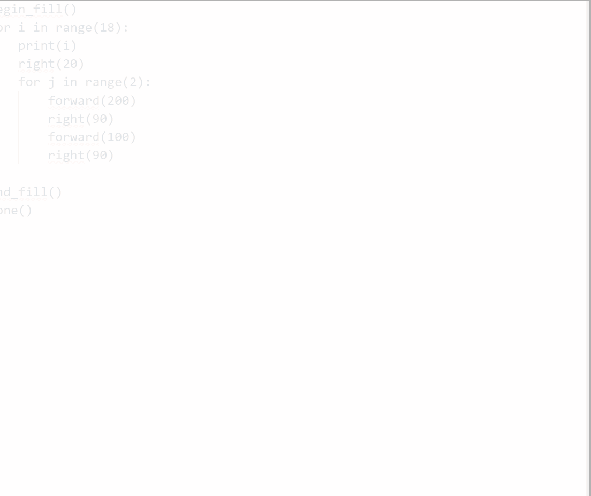

# Turtle - Pattern with Rectangle

Like previous one where we played with **Circle** we can also do something similar with **Rectangle**.

```python
from turtle import *

speed(12)
color("red", "yellow")
begin_fill()

for i in range(18):
    right(20)

    for j in range(2):
        forward(200)
        right(90)
        forward(100)
        right(90)

end_fill()
done()
```

## Outcome



---

[Next: Day 26 : Turtle - Multicolor Pattern](26-day26.md)

[Back to Index](index.md)
